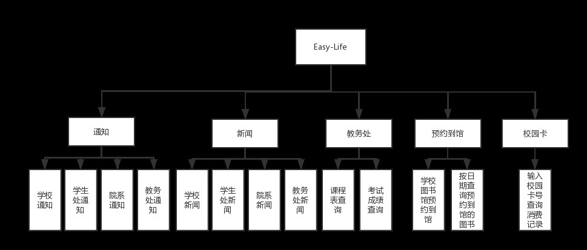
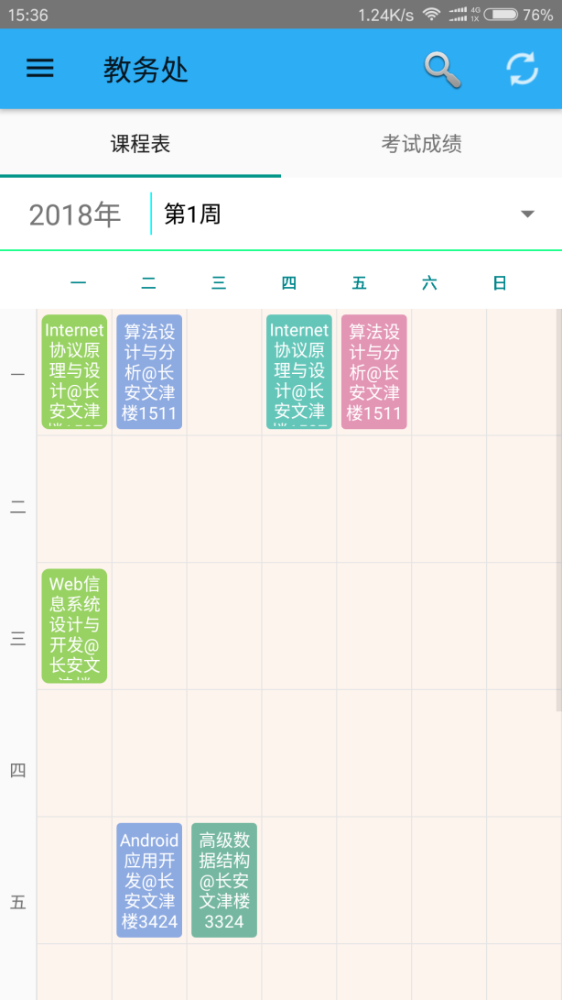
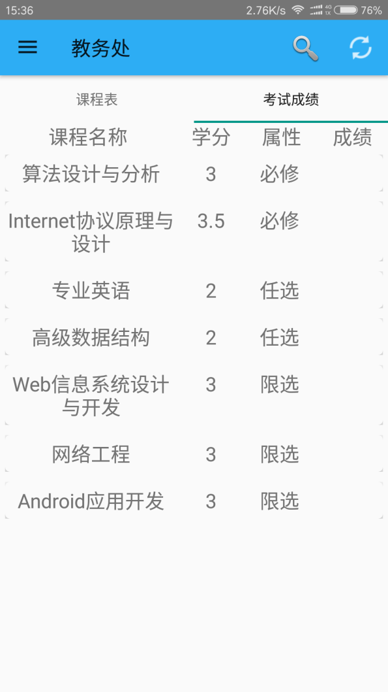
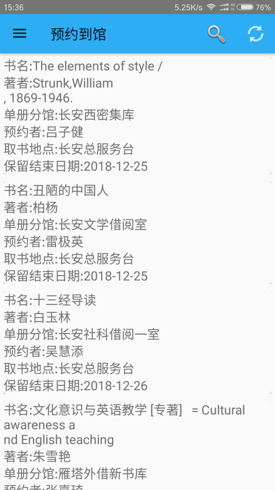
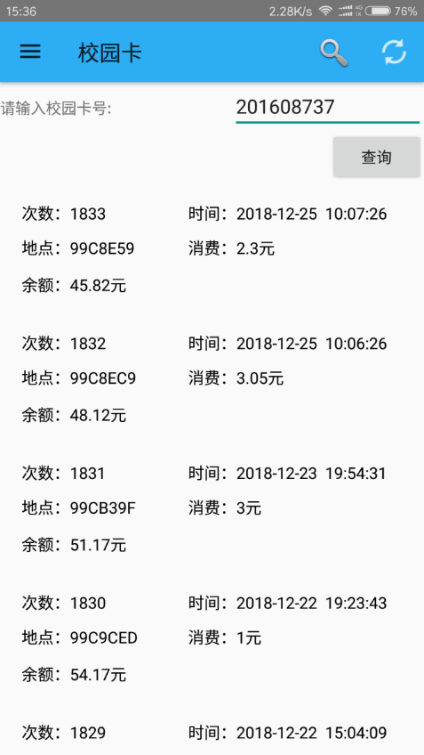
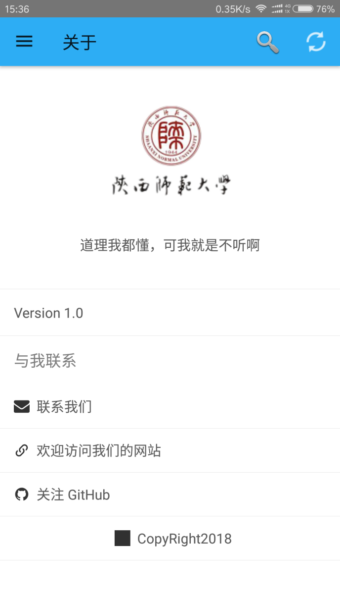

# SNNU-Android

## 简介
* 项目名称:基于C#和Python爬虫的校园信息平台 Android端
* 基金项目:陕西师范大学2018年勤助科研创新基金项目(项目编号:KY2018ZD005)
## 所用技术
* 前端UI：**Material Design**风格
* 页面布局：
	* 侧边栏菜单:利用DrawerLayout+NavigationView	实现滑动呼出侧边栏菜单。
	* 滑动切换页面:使用Tablayout + viewpager实现左右滑动切换标签。
	* 页面切换:使用多个fragment进行页面切换
* 后端:
	* 爬虫爬取校园网数据：[SNNU-SDK](https://github.com/snnucs/SNNU-SDK)
	* [Restful API](https://github.com/snnucs/SNNU-API) ,Flask,Python
	* [WebService](https://github.com/snnucs/SnnuWebService),C#

## 功能结构图

## 相关文档
* [设计文档](./doc/《基于Android的校园信息平台》.docx)
* [答辩ppt](《基于Android的校园信息平台》.pptx)

## Demo

### Welcome

### 校园通知

### 教务处

### 预约到馆

### 校园卡

### 关于

## 开源协议 & 作者
* 作者:Qi Zhao([zhaoqi99@outlook.com](mailto:zhaoqi99@outlook.com))
* 开源协议:[GNU General Public License v3.0](https://github.com/snnucs/SNNU-Android/blob/master/LICENSE)